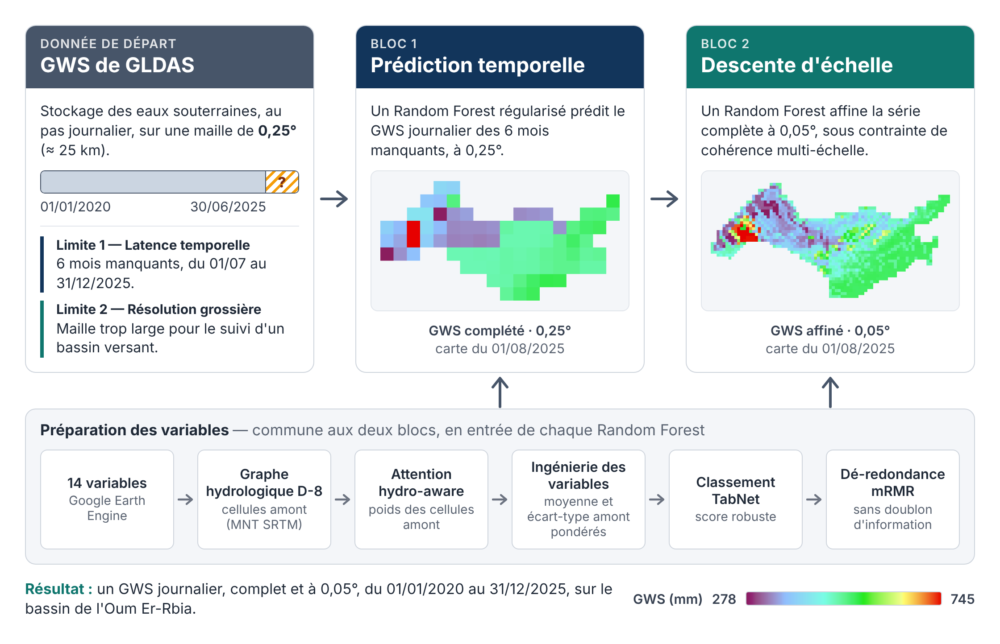
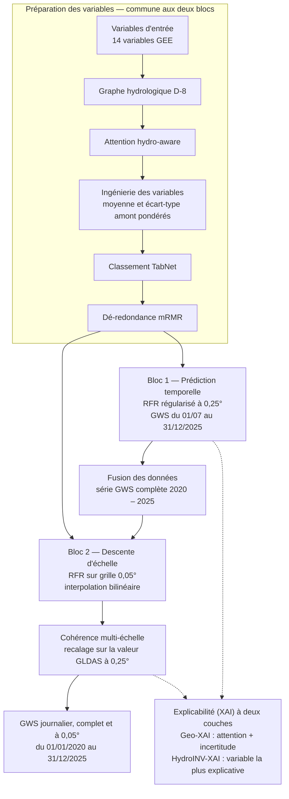
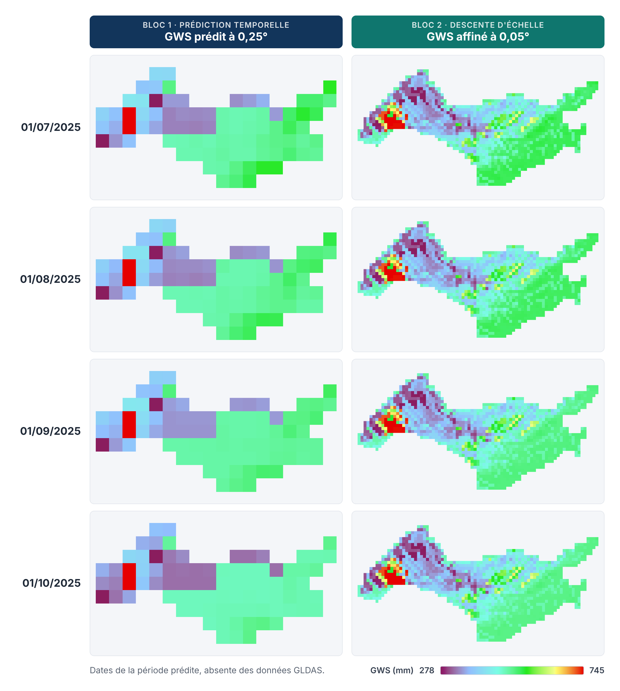
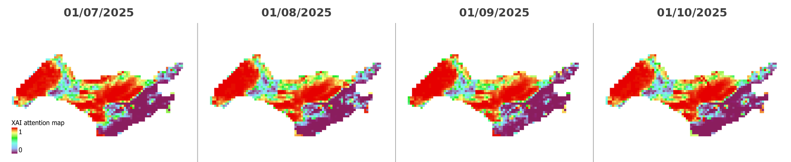
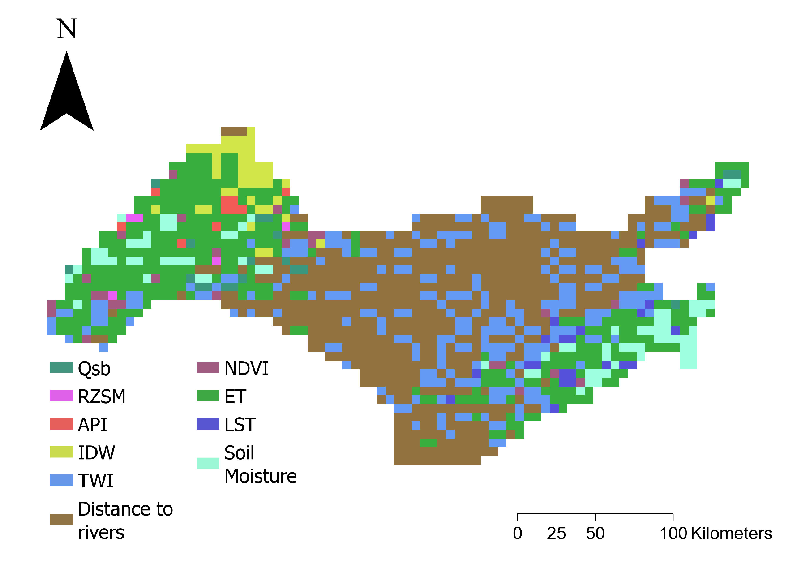

# Un pipeline spatio-temporel pour prédire le stockage des eaux souterraines (GWS)

**Bassin de l'Oum Er-Rbia, Maroc**



*Vue d'ensemble de l'approche. Les deux cartes sont celles du 01/08/2025, une date absente des données GLDAS.*

Ce travail complète et affine les données de stockage des eaux souterraines (GWS, *Groundwater Storage*) de GLDAS sur le bassin de l'Oum Er-Rbia. Il enchaîne deux blocs de prédiction, tous deux fondés sur un Random Forest « hydro-aware » :

- **Bloc 1 — Prédiction temporelle :** comble les 6 mois de GWS absents de GLDAS (du 01/07/2025 au 31/12/2025), au pas journalier et à 0,25°.
- **Bloc 2 — Descente d'échelle :** affine la résolution de 0,25° à 0,05° sur toute la période d'étude (2020 – 2025).

Le résultat est une série de GWS journalière, complète et à 0,05°, du 01/01/2020 au 31/12/2025.

Les prédictions des deux blocs sont expliquées par une **approche d'explicabilité (XAI) à deux couches** : **Geo-XAI** montre *où* le modèle concentre son attention et *où* il est le moins sûr, et **HydroINV-XAI** identifie *quelle variable d'entrée* explique chaque prédiction (voir [4.5](#45-explicabilité-xai--une-approche-à-deux-couches) et [6.4](#64-explicabilité--résultats-et-interprétations)).

Ce dépôt contient les notebooks Google Colab de l'approche proposée et des 16 modèles de référence : voir [Contenu du dépôt](#7-contenu-du-dépôt) et [Exécution sur Google Colab](#8-exécution-sur-google-colab).

| Indicateur | Pipeline proposé | Random Forest de base |
|---|---|---|
| R² (prédiction temporelle) | 0,993 | 0,985 |
| RMSE (prédiction temporelle) | 1,29 mm | 2,58 mm |
| MAE (prédiction temporelle) | 0,85 mm | 1,21 mm |
| Corrélation de Pearson (descente d'échelle) | 0,972 | 0,948 |

---

## 1. Contexte et problématique

### GLDAS

Le *Global Land Data Assimilation System* (GLDAS) est un système d'assimilation de données qui combine des observations satellites, des observations au sol et des modèles de surface terrestre. Il modélise les variables du cycle de l'eau terrestre (température du sol, humidité, évapotranspiration, etc.) et fournit des simulations hydrologiques à une résolution d'environ 25 km.

GLDAS intègre :

- des données satellitaires (MODIS, GRACE et GRACE-FO) ;
- des données météorologiques globales (précipitations, température, vent) ;
- des observations au sol et de stations météorologiques.

### Pourquoi compléter et affiner le GWS de GLDAS ?

Les données GWS de GLDAS présentent deux limites sur le bassin, traitées chacune par un bloc de prédiction.

| Limite | Constat | Réponse du pipeline |
|---|---|---|
| Latence temporelle | Les données ne sont pas disponibles en temps réel : le GWS journalier existe du 01/01/2020 au 30/06/2025, et il manque 6 mois, du 01/07/2025 au 31/12/2025. | **Bloc 1 — Prédiction temporelle :** prédire le GWS journalier des 6 mois manquants à partir de l'historique. |
| Résolution grossière | La maille de 0,25° (≈ 25 km) est trop grossière pour un suivi à l'échelle d'un bassin versant. | **Bloc 2 — Descente d'échelle :** passer de 0,25° à 0,05° sur toute la période 2020 – 2025. |

---

## 2. Zone d'étude : le bassin de l'Oum Er-Rbia

L'Oum Er-Rbia est l'un des bassins les plus stratégiques du Maroc, sur les plans hydrologique et agricole.

- **35 000 km²**, soit 7 % du territoire national.
- **Plus de 16 barrages**, dont 11 classés « grands ».
- **≈ 107 000 ha** de terres irriguées.
- **Moins de 25 %** : taux de remplissage moyen des barrages au Maroc après les sécheresses répétées.

Le GWS de GLDAS y suit de près les épisodes de sécheresse observés par le NDVI (MODIS).

---

## 3. Données d'entrée

Quatorze variables sont extraites par des scripts Google Earth Engine sur le bassin, au pas journalier, du 01/01/2020 au 31/12/2025.

| Variable | Pas de temps | Source | Résolution |
|---|---|---|---|
| Précipitations IDW | Journalier | CHIRPS Daily (dérivé) | 0,05° |
| Précipitations API (indice antécédent) | Journalier | CHIRPS Daily (dérivé) | 0,05° |
| Humidité de la zone racinaire (RZSM) | Journalier | SMAP SPL4SMGP | 11 km |
| Humidité du sol (SM) | Journalier | SMAP SPL4SMGP | 11 km |
| Température de surface (LST) | Journalier | MODIS MOD11A1 | 1 km |
| Ruissellement de subsurface (Qsb) | Journalier | ERA5-Land (ECMWF) | ≈ 0,1° |
| Évapotranspiration (ET) | Composite 8 jours | MODIS MOD16A2GF | 500 m |
| NDVI | Composite 16 jours | MODIS MOD13Q1 | 250 m |
| Indice topographique d'humidité (TWI) | Statique | Dérivé du SRTM | 30 m |
| Pente | Statique | Dérivé du SRTM | 30 m |
| Distance aux cours d'eau | Statique | Dérivé de HydroSHEDS | 30 m |
| Stockage des eaux souterraines (GWS) — cible | Journalier | GLDAS-2.2 CLSM (`GWS_tavg`) | 0,25° |
| sin(2π·DoY/365) et cos(2π·DoY/365) | Journalier | Calculées (saisonnalité) | — |

- Les rasters non journaliers (ET, NDVI) sont dupliqués sur leur période de rééchantillonnage.
- Les deux variables de saisonnalité ne servent qu'au bloc de prédiction temporelle.

---

## 4. Méthode

### 4.1 Architecture globale



Les variables sélectionnées alimentent un Random Forest régularisé dans chacun des deux blocs. Les prédictions des deux blocs sont ensuite expliquées par la couche XAI (section 4.5).

### 4.2 Préparation des variables (commune aux deux blocs)

#### Graphe hydrologique D-8

Pour chaque cellule d'un raster, ses 8 voisines (diagonales comprises) sont examinées. Le MNT SRTM donne la direction d'écoulement, donc les cellules situées en amont de chaque cellule.

#### Ingénierie des variables hydrologiques

Deux nouvelles cartes sont calculées pour chaque variable d'entrée, sur les *M* pixels amont de chaque cellule *x*.

Moyenne amont pondérée :

```math
y(x) = \sum_{i=1}^{M} w_i\, a_i
```

Écart-type amont pondéré :

```math
z(x) = \sqrt{\sum_{i=1}^{M} w_i\, a_i^{2} - \big(y(x)\big)^{2}}
```

où a<sub>i</sub> est la valeur de la variable au pixel amont *i* et w<sub>i</sub> le poids fourni par l'attention hydro-aware.

#### Carte d'attention « hydro-aware »

L'attention de chaque cellule amont est bornée entre 0 et 1, combinée à un terme topographique, puis normalisée par softmax :

```math
A_i = \mathrm{sigmoid}(\mathrm{logits}_i)
```

```math
\mathrm{score}_i = \beta_{att}\,A_i + \gamma_{att}\,\dfrac{DEM(i) - DEM(x)}{\sigma_{DEM} + \varepsilon}
```

```math
w_i = \dfrac{e^{\mathrm{score}_i}}{\sum_{j=1}^{M} e^{\mathrm{score}_j}}
```

- β<sub>att</sub>·A<sub>i</sub> : attention accordée à la cellule amont *i*.
- Terme topographique (pondéré par γ<sub>att</sub>) : favorise les cellules amont qui contribuent réellement à la cellule *x*, d'après le MNT.
- σ<sub>DEM</sub> : écart-type de l'altitude sur tout le bassin ; il ramène l'écart d'altitude à l'échelle du bassin.
- Softmax : les poids w<sub>i</sub> sont positifs et de somme 1 sur les *M* cellules amont.

Cette attention joue sur deux dimensions : elle filtre les variables d'entrée et calcule les poids spatiaux, pour guider l'apprentissage du Random Forest vers l'information hydrologiquement pertinente.

#### Classement et sélection des variables : TabNet puis mRMR

**1. Classement robuste (TabNet).** TabNet est entraîné *R* fois de façon indépendante ; I<sub>k</sub><sup>(r)</sup> est l'importance de la variable *k* à l'entraînement *r*. Le score pénalise l'instabilité entre entraînements, et les variables sont classées par score décroissant :

```math
\mu_k = \dfrac{1}{R}\sum_{r=1}^{R} I_k^{(r)}, \qquad
\sigma_k = \mathrm{std}\!\left(I_k^{(1)}, \ldots, I_k^{(R)}\right), \qquad
s_k^{\mathrm{robuste}} = \mu_k - \alpha_{\mathrm{robuste}}\,\sigma_k
```

**2. Dé-redondance (mRMR).** Le critère *redondance minimale, pertinence maximale* retient les variables pertinentes sans doublon d'information :

```math
\text{sélection}_{\mathrm{score}}(i) = s_i^{\mathrm{robuste}} - \alpha\left(\dfrac{1}{|S|}\sum_{j\in S} \big|\mathrm{corr}(x_i, x_j)\big|\right)
```

où *S* désigne les variables déjà retenues, corr la corrélation de Pearson, et α la pénalité de redondance avec *S*.

**Regroupement.** Chaque variable brute est évaluée avec ses deux dérivées hydrologiques (moyenne et écart-type amont pondérés). Un groupe est retenu selon la moyenne des scores de ses trois variables.

### 4.3 Bloc 1 — Prédiction temporelle

- **Objectif :** compléter la série GWS de GLDAS du 01/07/2025 au 31/12/2025, au pas journalier.
- **Modèle de base :** Random Forest Regressor (RFR) ; la prédiction est la moyenne des estimations de tous les arbres.
- **Entrées :** les variables hydro-climatiques et topographiques, enrichies par le graphe D-8 et l'attention hydro-aware.
- **Apprentissage :** historique du 01/01/2020 au 30/06/2025, découpé chronologiquement en 90 % d'entraînement et 10 % de test.

#### Encodage de la saisonnalité

Le jour de l'année (DoY) est converti en angle sur un cercle, ce qui donne deux variables d'entrée supplémentaires :

```math
\sin\!\left(\dfrac{2\pi\,DoY}{365}\right) \qquad \cos\!\left(\dfrac{2\pi\,DoY}{365}\right)
```

Le RFR tient ainsi compte de la périodicité annuelle, à la manière des modèles séquentiels (LSTM, RNN).

#### Régularisation contre le sur-apprentissage

Cinq scénarios d'hyper-paramètres limitent la complexité des arbres.

| Scénario | Profondeur max | Division min | Feuille min | Variables max | Échantillons max |
|---|---|---|---|---|---|
| 1 | 30 | 20 | 10 | 0,50 | 0,90 |
| 2 | 25 | 20 | 10 | 0,40 | 0,80 |
| 3 | 25 | 30 | 15 | 0,40 | 0,80 |
| 4 | 20 | 30 | 20 | 0,35 | 0,70 |
| 5 | 18 | 40 | 25 | 0,30 | 0,70 |

R² est calculé en entraînement et en validation pour chaque scénario ; celui au score le plus élevé est retenu :

```math
\mathrm{score}_{\text{sélection}} = R^2_{\mathrm{val}} - \lambda \times \max\!\left(0,\; R^2_{\mathrm{entr}} - R^2_{\mathrm{val}}\right)
```

Le terme max(…) détecte le sur-apprentissage (R² d'entraînement supérieur au R² de validation) ; λ en règle la pénalité.

### 4.4 Bloc 2 — Descente d'échelle (0,25° → 0,05°)

1. **Fusion.** Le GWS prédit par le bloc 1 est fusionné avec l'historique : une seule série, 2020 – 2025.
2. **Reprojection.** Toutes les variables d'entrée sont reprojetées sur la grille CHIRPS (0,05°) par interpolation bilinéaire.
3. **Enrichissement.** Mêmes étapes que le bloc 1 : graphe D-8, attention hydro-aware, ingénierie des variables, TabNet, mRMR (sans les variables sin / cos).
4. **Prédiction.** Le RFR est entraîné sous contrainte de cohérence multi-échelle avec le GWS d'origine.

**Pourquoi une interpolation bilinéaire ?** Elle utilise les 4 pixels voisins, pondérés selon leur distance au pixel cible. Elle convient aux variables continues, car elle préserve la continuité spatiale au lieu de dupliquer les valeurs (plus proche voisin), pour un faible coût de calcul.

#### Module de cohérence multi-échelle

Pendant l'apprentissage, les prédictions à 0,05° sont corrigées pour rester fidèles au GWS d'origine à 0,25° :

```math
\Delta(k) = y^{\,\text{grossier}}(k) - \bar{\hat{y}}^{\,\text{affiné}}(k)
```

```math
\hat{y}^{\,\text{affiné}}_{\text{corrigé}}(x) = \hat{y}^{\,\text{affiné}}(x) + \Delta(k)\,\dfrac{A(x)}{\bar{A}(k) + \varepsilon}, \qquad x \in \mathcal{P}_k
```

- ŷ(x) : prédiction fine initiale au pixel *x*.
- Δ(k) : écart entre la valeur GLDAS d'origine de la cellule grossière *k* et la moyenne des prédictions fines sur cette cellule.
- A(x) : poids d'attention hydro-aware du pixel fin *x* ; Ā(k) : attention moyenne sur la cellule *k*.
- P<sub>k</sub> : pixels fins contenus dans la cellule *k* ; ε évite la division par zéro.

L'écart Δ(k) est donc redistribué entre les pixels fins au prorata de leur attention : la correction va là où l'information hydrologique est la plus pertinente.

### 4.5 Explicabilité (XAI) : une approche à deux couches

Le pipeline combine deux blocs de prédiction et plusieurs contributions : une couche d'explicabilité est donc nécessaire pour comprendre ses prédictions. Elle répond à deux questions complémentaires.

| Couche | Question | Principe |
|---|---|---|
| **Geo-XAI** (descriptive) | *Où ?* | Zones sur lesquelles le modèle se concentre, et zones où il est le moins confiant |
| **HydroINV-XAI** (inverse, « hydro-aware ») | *Quelle variable ?* | Variable d'entrée qui explique le mieux chaque prédiction, mesurée par sa réponse à de petites perturbations |

#### Geo-XAI : explication géographique

- **Carte d'attention :** la carte d'attention hydro-aware produite à chaque prédiction (bloc temporel et bloc de descente d'échelle) sert de carte explicative.
- **Carte d'incertitude :** pour chaque pixel *x*, écart-type des prédictions des *M* arbres du Random Forest :

```math
\mathrm{err}(x) = \sqrt{\dfrac{1}{M}\sum_{m=1}^{M} \big(\hat{y}_m(x) - \bar{y}(x)\big)^2}
```

où ŷ<sub>m</sub>(x) est la prédiction de l'arbre *m* et ȳ(x) la moyenne des prédictions de tous les arbres. Un écart-type élevé signale une prédiction peu fiable.

La lecture se fait à deux niveaux : la capacité du modèle à se concentrer sur certaines zones, et la localisation des pixels où ses prédictions sont les moins sûres, pour les deux blocs.

#### HydroINV-XAI : explication inverse « hydro-aware »

1. **Pixels cibles :** les pixels aux plus fortes prédictions (au-dessus du 90<sup>e</sup> centile) :

```math
\mathcal{S} = \{\, x \in \Omega \;:\; \hat{y}(x) \geq Q_{0,90}(\hat{y}) \,\}
```

2. **Sensibilité locale et variation requise :** pour chaque pixel cible *x′* et chaque variable *v*, l'écart Δy = y′ − ŷ(x′) est converti en variation d'entrée, à partir du gradient local de la prédiction (la variable est ignorée si |h<sub>v</sub>| < ε) :

```math
h_v = \dfrac{\delta y_v}{\varepsilon}, \qquad \Delta\mu_v = \dfrac{\Delta y}{h_v}
```

3. **Répartition sur les cellules amont :** la variation est distribuée sur les cellules amont de *x′*, pondérées par β (calculé à partir de la carte d'attention et du graphe D-8), en cherchant la plus petite perturbation, bornée par l'écart-type spatial journalier σ<sub>v,d</sub> de la variable :

```math
\Delta V_v = \arg\min_{\Delta V} \lVert \Delta V \rVert_2^2 \quad \text{avec} \quad \beta^{\top}\Delta V \approx \Delta\mu_v, \quad |\Delta V_i| \leq \sigma_{v,d}
```

4. **Coût de l'explication :** la variable de coût minimal est retenue comme la plus explicative du pixel :

```math
\mathrm{Cost}_v = \lVert \Delta V_v \rVert_1 + 10\,\big|\Delta y - h_v\,\beta^{\top}\Delta V_v\big|
```

Le premier terme mesure l'ampleur de la perturbation ; le second, pondéré par 10, l'écart entre l'erreur à expliquer et celle produite par la seule variable *v*. Pour chaque date, on obtient la variable la plus explicative de chaque pixel, ainsi que les cartes des poids β et des perturbations ΔV.

---

## 5. Protocole expérimental et évaluation

Pour chaque bloc, les données sont découpées chronologiquement (90 % entraînement, 10 % test) et le pipeline est comparé à une série de modèles de régression de référence, du linéaire au boosting, dont le RFR de base.

### Métriques

**Bloc 1 — Prédiction temporelle**

| Métrique | Rôle |
|---|---|
| R² (coefficient de détermination) | Part de la variance expliquée |
| RMSE (racine de l'erreur quadratique moyenne) | Sensible aux grosses erreurs |
| MAE (erreur absolue moyenne) | Écart moyen aux observations |

```math
R^2 = 1 - \dfrac{\sum_{i=1}^{n} (y_i - \hat{y}_i)^2}{\sum_{i=1}^{n} (y_i - \bar{y})^2}, \qquad
\mathrm{RMSE} = \sqrt{\dfrac{1}{n}\sum_{i=1}^{n} (y_i - \hat{y}_i)^2}, \qquad
\mathrm{MAE} = \dfrac{1}{n}\sum_{i=1}^{n} |y_i - \hat{y}_i|
```

**Bloc 2 — Descente d'échelle**

Les images à 0,05° sont ré-agrégées sur la grille d'origine (moyenne des pixels fins de chaque cellule à 0,25°), puis comparées aux images GLDAS par la corrélation de Pearson :

```math
\mathrm{Corr}(x, y) = \dfrac{\sum_{i=1}^{n} (x_i - \bar{x})(y_i - \bar{y})}{\sqrt{\sum_{i=1}^{n} (x_i - \bar{x})^2}\;\sqrt{\sum_{i=1}^{n} (y_i - \bar{y})^2}}
```

### Données de validation : mesures piézométriques de terrain

- **15 puits piézométriques** répartis sur le bassin.
- **22 jours de mesures**, entre le 24/01/2020 et le 19/04/2021.
- **Source :** Agence du Bassin Hydraulique de l'Oum Er-Rbia (ABHOER).

Ces mesures servent de vérité terrain pour valider les prédictions du pipeline. Limite : un réseau plus étendu ou davantage de mesures rendrait la validation plus fiable.

---

## 6. Résultats

Dans les deux tableaux, R², MAE et RMSE concernent le bloc de prédiction temporelle, et la corrélation de Pearson le bloc de descente d'échelle.

### 6.1 Apport de chaque contribution

Les contributions sont ajoutées de façon cumulée au RFR de base (« — » : non applicable).

| Contribution (cumulée) | R² | MAE (mm) | RMSE (mm) | Pearson |
|---|---|---|---|---|
| RFR de base | 0,9850 | 1,2102 | 2,5785 | 0,948 |
| + Encodage saisonnier (sin, cos) | 0,9871 | 1,0836 | 2,1764 | — |
| + Graphe D-8 | 0,9878 | 1,0179 | 2,0237 | 0,952 |
| + Ingénierie des variables | 0,9885 | 0,9683 | 1,8846 | 0,957 |
| + Attention hydro-aware | 0,9891 | 0,9214 | 1,6927 | 0,963 |
| + Classement TabNet | 0,9898 | 0,8821 | 1,5038 | 0,968 |
| + mRMR | 0,9930 | 0,8467 | 1,2894 | 0,970 |
| + Cohérence multi-échelle | — | — | — | 0,972 |

Entre le RFR de base et le pipeline complet :

- la RMSE est divisée par deux (2,58 → 1,29 mm) ;
- la MAE baisse de 30 % (1,21 → 0,85 mm) ;
- la corrélation de Pearson passe de 0,948 à 0,972.

### 6.2 Comparaison avec les modèles de référence

Modèles classés par R² décroissant.

| Modèle | R² | MAE (mm) | RMSE (mm) | Pearson |
|---|---|---|---|---|
| **Pipeline proposé** | **0,993** | **0,8467** | **1,2894** | **0,972** |
| Random Forest (RFR) | 0,9850 | 1,2102 | 2,5785 | 0,948 |
| ExtraTrees | 0,9820 | 1,5763 | 3,3616 | 0,936 |
| XGBoost | 0,9740 | 3,3700 | 14,9472 | 0,901 |
| LightGBM | 0,9238 | 14,8737 | 23,0029 | 0,845 |
| HistGradientBoosting | 0,8992 | 17,5589 | 26,4521 | 0,824 |
| Gaussian Process | 0,8027 | 23,6360 | 36,9783 | 0,781 |
| Gradient Boosting | 0,6827 | 34,9035 | 46,9377 | 0,692 |
| KNN | 0,6378 | 33,1610 | 50,1524 | 0,671 |
| MLP | 0,6236 | 37,7136 | 51,1276 | 0,654 |
| SVR | 0,4306 | 41,4733 | 62,8815 | 0,587 |
| Huber | 0,2602 | 54,1506 | 71,6770 | 0,501 |
| Ridge | 0,2582 | 56,6107 | 71,7704 | 0,495 |
| Régression linéaire | 0,2544 | 57,1848 | 71,9546 | 0,491 |
| Lasso | 0,2544 | 57,1850 | 71,9543 | 0,490 |
| RANSAC | 0,2464 | 53,6338 | 72,3390 | 0,486 |
| ElasticNet | 0,2266 | 58,7944 | 73,2867 | 0,472 |

- **R² de 99,3 %** pour le bloc de prédiction temporelle (98,5 % pour le RFR de base).
- **RMSE de 1,29 mm**, contre 2,58 mm pour le RFR de base et plus de 3 mm pour tous les autres modèles.
- **Corrélation de Pearson de 97,2 %** pour le bloc de descente d'échelle (94,8 % pour le RFR de base).

### 6.3 Cartes de GWS prédites puis affinées

Exemples de cartes produites pour quatre dates de la période prédite, absente des données GLDAS : 01/07/2025, 01/08/2025, 01/09/2025 et 01/10/2025. Chaque date est représentée à 0,25° (sortie du bloc 1) et à 0,05° (sortie du bloc 2), sur une même échelle de couleurs allant de 278 à 745 mm.



*Cartes de GWS prédites à 0,25° (à gauche), puis affinées à 0,05° (à droite).*

- Les prédictions temporelles sont spatialement lisses, donc plausibles sur toute la période prédite.
- Les cartes à 0,05° restent alignées sur les cartes à 0,25° : même structure spatiale, avec un détail nettement plus fin.
- Les résultats sont cohérents d'une date à l'autre pour les deux blocs.

### 6.4 Explicabilité : résultats et interprétations

#### Geo-XAI : cartes d'attention



*Cartes d'attention XAI aux quatre dates de la période prédite (attention de 0 à 1).*

- La distribution de l'attention amont reste **stable d'une date à l'autre** : les variables importantes pour la prédiction sont les mêmes dans le temps, ce qui valide l'attention hydro-aware.
- **Plus de 80 % du bassin** présente une attention élevée, proche de 1, là où les variables d'entrée présentent une forte variabilité spatiale et temporelle.

#### HydroINV-XAI : variables d'entrée les plus explicatives

Les résultats de l'algorithme inverse sont moyennés sur tous les pixels d'une image, puis sur toutes les valeurs prédites par les deux blocs.



*Variable la plus explicative pour chaque pixel du bassin.*

| Rang | Variable | Nombre moyen de pixels | Écart-type |
|---|---|---|---|
| 1 | Distance aux cours d'eau | 520 | 18,3 |
| 2 | TWI | 300 | 15,4 |
| 3 | Évapotranspiration (ET) | 260 | 14,6 |
| 4 | Ruissellement de subsurface (Qsb) | 110 | 10,0 |
| 5 | Humidité de la zone racinaire (RZSM) | 85 | 9,0 |
| 6 | Précipitations API | 60 | 7,7 |
| 7 | Précipitations IDW | 45 | 6,6 |
| 8 | NDVI | 30 | 5,4 |
| 9 | Température de surface (LST) | 25 | 5,0 |
| 10 | Humidité du sol (SM) | 19 | 4,3 |
| 11 | Pente | 1 | 1,0 |

Les variables se répartissent en trois groupes :

- **Variables dominantes — distance aux cours d'eau, TWI, ET :** elles dominent la majorité des pixels du bassin et forment l'ensemble explicatif principal des prédictions.
- **Influence secondaire — Qsb, RZSM, API, IDW, NDVI :** leur influence sur le GWS est plus faible, mais elles sont le facteur explicatif dominant dans certaines sous-zones du bassin.
- **Influence marginale — LST, humidité du sol, pente :** elles expliquent très rarement la variation du GWS sur le bassin et peuvent être exclues de l'analyse.

En résumé, la proximité du réseau hydrographique, la topographie (TWI) et l'évapotranspiration expliquent l'essentiel des prédictions de GWS sur l'Oum Er-Rbia.

---

## 7. Contenu du dépôt

```text
.
├── README.md
├── .gitignore
├── assets/
│   ├── approche_pipeline.png
│   ├── resultats_cartes_gws.png
│   ├── xai_cartes_attention.png
│   └── xai_variables_decisives.png
└── notebooks/
    ├── approche_proposee/
    │   └── SR_GWS_HADA_HydroFE_Colab_avecXAI.ipynb
    └── modeles_reference/
        ├── GWS_RFR_Colab.ipynb
        ├── GWS_ExtraTreesRegressor_Colab.ipynb
        ├── GWS_XGboost_Colab.ipynb
        ├── GWS_Light_GBM_Colab.ipynb
        ├── GWS_HISTGRADIENTBOOSTING_Colab.ipynb
        ├── GWS_GaussianProcess_Colab.ipynb
        ├── GWS_GradientBoosting_Colab.ipynb
        ├── GWS_KNN-Regressor_Colab.ipynb
        ├── GWS_MLP_Regressor_Colab.ipynb
        ├── GWS_SVR_Colab.ipynb
        ├── GWS_HuberRegressor_Colab.ipynb
        ├── GWS_Ridge_Colab.ipynb
        ├── GWS_Linear_Regression_Colab.ipynb
        ├── GWS_Lasso_Colab.ipynb
        ├── GWS_RANSAC_Regressor_Colab.ipynb
        └── GWS_Elastiknet_Colab.ipynb
```

Les données (rasters) ne sont pas dans le dépôt : elles sont lues sur Google Drive.

### 7.1 Approche proposée

`notebooks/approche_proposee/SR_GWS_HADA_HydroFE_Colab_avecXAI.ipynb`

Ce notebook enchaîne la fusion des entrées, le graphe D-8 et l'attention hydro-aware (HADA), l'ingénierie des variables hydrologiques (Hydro-FE), la sélection de variables (TabNet puis mRMR), le Random Forest régularisé, l'export des prédictions à la résolution GLDAS, la descente d'échelle avec cohérence multi-échelle, puis l'explicabilité à deux couches (Geo-XAI et HydroINV-XAI) pour chaque date cartographiée.

| Élément | Valeur |
|---|---|
| Fichier d'index lu | `name_files_SR.txt` |
| Sections attendues | `CHIRPS_Clipped`, `Precipitations_API`, `Total_GWS`, `SMAP_RZSM_Clipped` (optionnelle), `Slope`, `MNT`, `TWI`, `Distance_To_River` |
| Dossier de sortie | `input_data_ML/SR_GWS_FUSION_HADA_HYDROFE_FS_XAI_HYDROINV_MULTI` |
| Sorties | Rasters à résolution fine, prédictions à la résolution GLDAS (sous-dossier `COARSE_PRED`), fichiers de sélection de variables, sorties Geo-XAI (sous-dossier `XAI`) et HydroINV-XAI (sous-dossier `XAI_HYDROINV`) |

#### Sorties de l'explicabilité

| Couche | Fichiers (par date `AAAAMMJJ`) |
|---|---|
| Geo-XAI — `XAI/<date>/` | `XAI_Attention_<date>.tif` (carte d'attention, 0 → 1), `XAI_UncertaintySTD_<date>.tif` (écart-type des arbres du RF), `XAI_Feature_<variable>_<date>.tif` (variables et leurs dérivées amont), `XAI_MaskUsed_<date>.tif`, `XAI_FeatureStats_<date>.csv` |
| HydroINV-XAI — `XAI_HYDROINV/` | `HydroINV_ResponsibilityCorridor_<date>.tif` (corridor amont responsable), `HydroINV_DeltaRAW_<variable>_<date>.tif` (perturbations ΔV retenues), `HydroINV_TargetPixels_<date>.csv` (variable choisie pour chaque pixel cible) |

La dernière section du notebook (*12. Analyse des sorties XAI*) relit ces fichiers. Elle affiche les cartes d'attention et d'incertitude, calcule la part du bassin à forte attention et la stabilité de l'attention entre dates, puis classe les variables selon le nombre moyen de pixels cibles qu'elles expliquent. Ses tableaux sont enregistrés dans `XAI/GeoXAI_Indicateurs.csv` et `XAI_HYDROINV/HydroINV_Classement_variables.csv`.

#### Paramètres de l'explicabilité (cellule 0.3)

| Paramètre | Valeur par défaut | Rôle |
|---|---|---|
| `XAI_ENABLE` / `INV_ENABLE` | `True` / `True` | Active Geo-XAI / HydroINV-XAI |
| `XAI_UNCERTAINTY_ENABLE` | `True` | Calcule la carte d'incertitude (écart-type des arbres) |
| `INV_TARGET_STRATEGY`, `INV_TARGET_QUANTILE` | `"TOP_QUANTILE"`, `0.90` | Pixels cibles : prédictions au-dessus du 90<sup>e</sup> centile |
| `INV_MAX_TARGET_PIXELS` | `150` | Nombre maximal de pixels cibles par date |
| `INV_TARGET_MODE`, `INV_TARGET_PCTL` | `"TO_PERCENTILE"`, `50.0` | Écart Δy à expliquer : vers la médiane des prédictions de la date |
| `INV_VARIABLES` | `["API", "CHIRPS", "RZSM"]` | Variables testées par HydroINV-XAI |
| `INV_TOPM_SOURCES` | `128` | Nombre maximal de cellules amont perturbées |
| `INV_MAX_DELTA_FACTOR`, `INV_EPS_FACTOR` | `1.0`, `0.02` | Borne de la perturbation (× écart-type spatial du jour) ; pas de la différence finie |
| `XAI_PREFIXES`, `XAI_EVERY_N_DATES` | `("HIST", "FORECAST")`, `1` | Ajout Colab : dates traitées par la XAI (toutes par défaut) |

Le notebook ne charge que les sections listées plus haut : HydroINV-XAI peut donc tester `CHIRPS`, `API`, `RZSM`, `TWI`, `DTR` (distance aux cours d'eau), `DEM` et `SLOPE`. Par défaut, le classement porte sur API, CHIRPS et RZSM. Pour le comparer à celui de la section 6.4, ajouter `TWI`, `DTR` et `SLOPE` à `INV_VARIABLES`.

### 7.2 Modèles de référence

Les 16 notebooks de `notebooks/modeles_reference/` correspondent aux modèles du tableau de la section 6.2. Ils lisent tous `name_files.txt` et écrivent leurs cartes (GeoTIFF) dans un dossier propre, sous `input_data_ML/`.

| Notebook | Modèle | Dossier de sortie |
|---|---|---|
| `GWS_RFR_Colab.ipynb` | Random Forest (RFR) | `GWS_PREDICTIONS_GEE_RF_IDW_APIIDW_TWI_DISTRIVER` |
| `GWS_ExtraTreesRegressor_Colab.ipynb` | ExtraTrees | `GWS_PREDICTIONS_GEE_EXTRATREES` |
| `GWS_XGboost_Colab.ipynb` | XGBoost | `GWS_PREDICTIONS_GEE_XGB_IDW_APIIDW_TWI_DISTRIVER` |
| `GWS_Light_GBM_Colab.ipynb` | LightGBM | `GWS_PREDICTIONS_GEE_LGBM` |
| `GWS_HISTGRADIENTBOOSTING_Colab.ipynb` | HistGradientBoosting | `GWS_PREDICTIONS_GEE_HISTGB` |
| `GWS_GaussianProcess_Colab.ipynb` | Gaussian Process | `GWS_PREDICTIONS_GEE_GPR` |
| `GWS_GradientBoosting_Colab.ipynb` | Gradient Boosting | `GWS_PREDICTIONS_GEE_GRADIENTBOOSTING` |
| `GWS_KNN-Regressor_Colab.ipynb` | KNN | `GWS_PREDICTIONS_GEE_KNN` |
| `GWS_MLP_Regressor_Colab.ipynb` | MLP | `GWS_PREDICTIONS_GEE_MLP` |
| `GWS_SVR_Colab.ipynb` | SVR | `GWS_PREDICTIONS_GEE_SVR` |
| `GWS_HuberRegressor_Colab.ipynb` | Huber | `GWS_PREDICTIONS_GEE_HUBER` |
| `GWS_Ridge_Colab.ipynb` | Ridge | `GWS_PREDICTIONS_GEE_RIDGE` |
| `GWS_Linear_Regression_Colab.ipynb` | Régression linéaire | `GWS_PREDICTIONS_GEE_LR` |
| `GWS_Lasso_Colab.ipynb` | Lasso | `GWS_PREDICTIONS_GEE_LASSO` |
| `GWS_RANSAC_Regressor_Colab.ipynb` | RANSAC | `GWS_PREDICTIONS_GEE_RANSAC` |
| `GWS_Elastiknet_Colab.ipynb` | ElasticNet | `GWS_PREDICTIONS_GEE_ELASTICNET` |

Sections de `name_files.txt` utilisées par ces notebooks :

- précipitations : `Precipitations_IDW` et, selon le notebook, `Precipitations_API_IDW` ;
- `MODIS_LST_Clipped`, `MODIS_NDVI_Clipped`, `MODIS_ET_Clipped` ;
- `ERA5_Qsb_Clipped`, `SMAP_RZSM_Clipped`, `SMAP_SoilM_Clipped` ;
- `GLDAS_GWS_Clipped` (cible) ;
- `TWI` et `Distance_To_River` pour les notebooks RFR, XGBoost et ExtraTrees.

Le notebook Gaussian Process fait exception sur deux points : il exige une section `CHIRPS_Clipped` pour les précipitations, et son entraînement est nettement plus long que celui des autres modèles.

---

## 8. Exécution sur Google Colab

### Préparer les données

1. Placer le dossier `input_data_ML` à la racine de « Mon Drive ». Les notebooks le lisent à l'emplacement `/content/drive/MyDrive/input_data_ML`.
2. Y déposer les rasters, ainsi que les fichiers d'index `name_files.txt` (modèles de référence) et `name_files_SR.txt` (approche proposée).

Un fichier d'index liste les rasters par section :

```text
[MODIS_LST_Clipped]
MODIS_LST_Clipped/LST_20210101.tif
MODIS_LST_Clipped/LST_20210102.tif

[GLDAS_GWS_Clipped]
GLDAS_GWS_Clipped/GWS_20210101.tif
```

Les chemins sont relatifs à `input_data_ML`, et la date de chaque raster journalier figure dans son nom de fichier (`AAAAMMJJ`). Les chemins écrits sous Windows (antislashs, chemins absolus `C:\...\input_data_ML\...`) sont convertis automatiquement.

### Lancer un notebook

1. Ouvrir le notebook dans Colab (*Fichier → Ouvrir un notebook → GitHub*, ou *Importer* le fichier `.ipynb`).
2. Lancer *Exécution → Tout exécuter*. Les premières cellules montent Google Drive, installent `rasterio` (et `pytorch-tabnet`, `lightgbm` ou `xgboost` selon le notebook), puis contrôlent que chaque entrée du fichier d'index correspond à un fichier présent sur Drive.
3. Les résultats sont écrits sur Drive, dans le dossier de sortie indiqué en section 7.

Le code des scripts d'origine est repris tel quel ; les lignes ajoutées ou modifiées pour Colab sont repérées par le commentaire `# [COLAB]`, et les cellules d'analyse ajoutées au notebook de l'approche proposée par `# [AJOUT]`.

### Durée de calcul de l'explicabilité

Par défaut, comme dans le script d'origine, l'explicabilité est calculée pour **toutes** les dates cartographiées (historique et période prédite). HydroINV-XAI est l'étape la plus longue, car elle calcule le gradient local du Random Forest pixel par pixel. Elle produit aussi un grand nombre de fichiers sur Drive.

Pour une session Colab plus courte, restreindre les dates dans la cellule 0.3 :

```python
XAI_PREFIXES = ("FORECAST",)   # uniquement la période prédite
XAI_EVERY_N_DATES = 30         # une date sur 30
```

`XAI_ENABLE = False` désactive entièrement l'explicabilité ; le notebook produit alors les mêmes sorties que la version sans XAI.

### Paramètres temporels réglés dans les notebooks

| Paramètre | Valeur dans les notebooks |
|---|---|
| `TRAIN_START` → `TRAIN_END` | 01/01/2021 → 30/06/2025 |
| `FORECAST_START` → `FORECAST_END` | 01/07/2025 → 30/10/2025 |
| `TEST_FRACTION` | 0,10 pour l'approche proposée et le RFR ; 0,05 pour les 15 autres modèles |

Ces valeurs se modifient dans la cellule « Paramètres » de chaque notebook. Pour couvrir toute la période décrite plus haut (historique à partir du 01/01/2020, prédiction jusqu'au 31/12/2025), il faut adapter ces dates.

---
